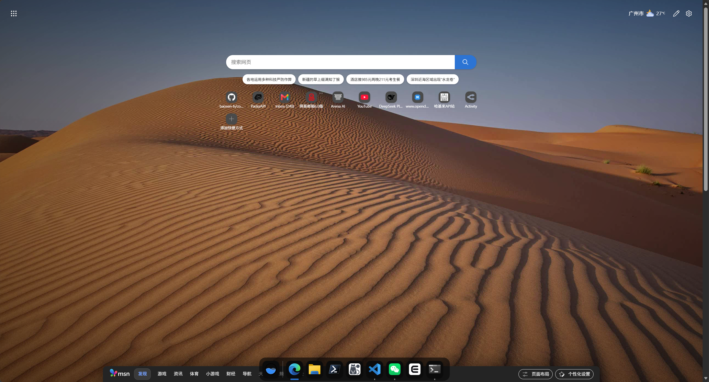
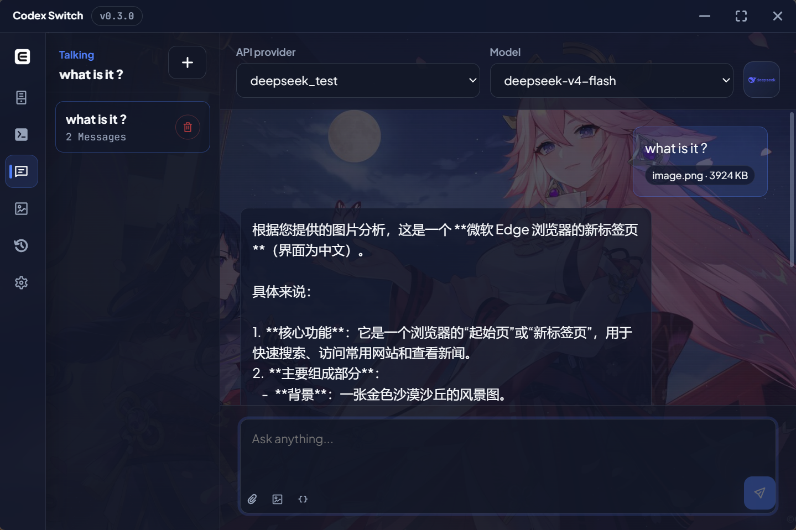
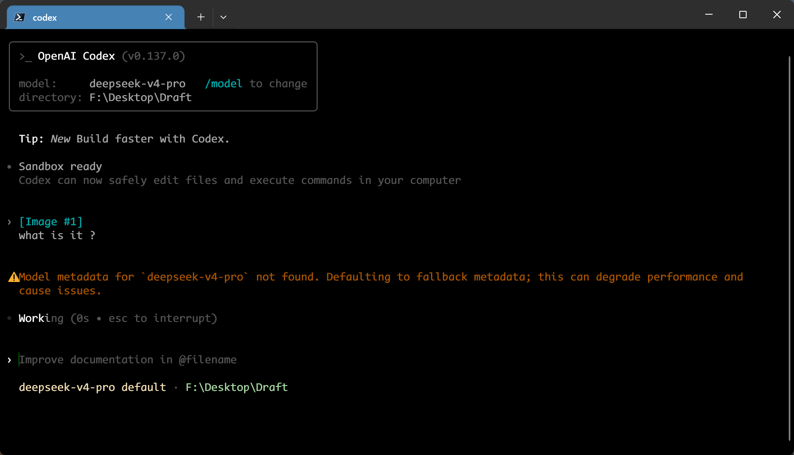
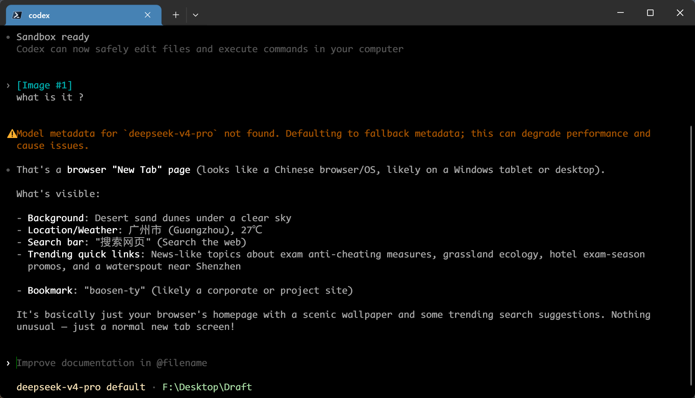

<p align="center">
  
</p>

<h1 align="center">Codex Switch</h1>

<p align="center">
  English · <a href="README.zh-CN.md">简体中文</a>
</p>

<p align="center">
  <a href="#product-introduction"></a>
  <a href="https://github.com/baosen-h/codex-switch/releases"></a>
  <a href="https://github.com/baosen-h/codex-switch/releases"></a>
  <a href="LICENSE"></a>
</p>

## Product Introduction

https://github.com/user-attachments/assets/615feeda-ae8e-4e95-9de2-3ab72f8a1a2f

Codex Switch is a Windows desktop app for managing Codex, Claude Code, and Gemini provider configs, plus chat, image generation, and local sessions. Built-in chat/completion translation helps Codex work with compatible models like DeepSeek, MiMo, and GLM, while configurable vision model support enables text-only models to understand images.

## Highlights

- API Providers: manage OpenAI, OpenAI Compatible / New API, Anthropic Compatible, Gemini, Ollama, OpenRouter, and Hugging Face records.
- Codex compatibility: translate chat/completion providers such as DeepSeek, MiMo, and GLM for Codex.
- Agents: generate Codex, Claude Code, and Gemini configs from provider records.
- Talking: chat with text, files, and images when the selected model supports them.
- Vision model support: let text-only models, such as text-only DeepSeek and GLM variants, understand images through a configurable vision model in Talking, Codex CLI, Claude Code, and Gemini CLI.
- Drawing: generate and edit images with supported models.
- Sessions: inspect local sessions, preview transcripts, copy resume commands, and generate handoff text.
- Capabilities: discover, review, install, and sync Skills and MCP servers across Codex, Claude Code, and Gemini. Marketplace sources are configurable, credentials use the operating system keychain, and installs remain pinned until explicitly updated.
- Settings: switch theme, background, directories, terminal, and release page access.

## Screenshots

<table>
  <tr>
    <th align="center">Providers</th>
    <th align="center">Agents</th>
  </tr>
  <tr>
    <td></td>
    <td></td>
  </tr>
  <tr>
    <td align="center"><sub>Manage OpenAI, OpenAI-compatible, Anthropic-compatible, Gemini, and other provider records.</sub></td>
    <td align="center"><sub>Generate and switch Codex, Claude Code, and Gemini configs from saved providers.</sub></td>
  </tr>
  <tr>
    <th align="center">Talking</th>
    <th align="center">Drawing</th>
  </tr>
  <tr>
    <td></td>
    <td></td>
  </tr>
  <tr>
    <td align="center"><sub>Chat with models that support text, files, and image input.</sub></td>
    <td align="center"><sub>Generate and edit images with supported image models.</sub></td>
  </tr>
</table>

<table>
  <tr>
    <th align="center">Settings</th>
  </tr>
  <tr>
    <td></td>
  </tr>
  <tr>
    <td align="center"><sub>Configure directories, language, theme, background, updates, and session recording.</sub></td>
  </tr>
</table>

### Vision Support for Text-Only Models

With a vision model configured in Codex Switch, text-only models can understand image input in **Talking**, **Codex CLI**, **Claude Code**, and **Gemini CLI**. DeepSeek is used below as one example, shown analyzing the same browser screenshot in Talking and Codex CLI.

<table>
  <tr>
    <th align="center">Input Image</th>
    <th align="center">Talking Result</th>
  </tr>
  <tr>
    <td width="50%"></td>
    <td width="50%"></td>
  </tr>
  <tr>
    <td align="center"><sub>The browser screenshot used to test image understanding.</sub></td>
    <td align="center"><sub>A text-only DeepSeek model analyzes the image in Talking.</sub></td>
  </tr>
  <tr>
    <th align="center">Codex CLI Request</th>
    <th align="center">Codex CLI Result</th>
  </tr>
  <tr>
    <td width="50%"></td>
    <td width="50%"></td>
  </tr>
  <tr>
    <td align="center"><sub>The same image is attached and sent through Codex CLI.</sub></td>
    <td align="center"><sub>DeepSeek receives the visual context and returns an image-aware response.</sub></td>
  </tr>
</table>

The image understanding is supplied by the vision provider and model selected under **Settings → Vision model**, while the original text-only model still produces the final response. This is not limited to DeepSeek; other text-only models can use the same vision support when their requests pass through Codex Switch.

## Automatic Web Search

Configure Tavily, Zhipu, Exa, Bocha, SearXNG, or Jina once under
**Settings → Automatic web search**. Chat-compatible models receive local
`web__search` and `web__fetch` tools and decide when they need current
information; there is no per-chat search mode. URL fetching can use the built-in
direct fetcher or Jina Reader. Provider-native web search remains unchanged and
takes priority when available.

Direct URL fetching validates every redirect, blocks private and reserved
network addresses, accepts readable text formats only, and limits responses to
10 MB. Search results use numbered source IDs so the model can add `[N]`
citations.

## Install

Download the latest Windows release:

https://github.com/baosen-h/codex-switch/releases/latest

## Build

```bash
npm install
npm run build
npm run tauri -- build
```

## Development

- Frontend architecture and contribution rules: [docs/frontend-architecture.md](docs/frontend-architecture.md)
- Feature ownership rules: [src/features/README.md](src/features/README.md)

## Notes

- Windows-first.
- API keys are stored locally in SQLite.
- Drawing is focused on OpenAI-compatible image endpoints.
- Vision model support only lists models verified to accept image input and return text.

## Reference Projects

Codex Switch was inspired by the following open-source projects:

- [CC Switch](https://github.com/farion1231/cc-switch) - Cross-platform manager for Claude Code, Codex, Gemini CLI, and other AI coding tools.
- [Codex Switcher](https://github.com/xtftbwvfp/codex-switcher) - Desktop account, quota, relay, and local proxy manager for Codex CLI and Codex App.
- [mimo2codex](https://github.com/7as0nch/mimo2codex) - Local proxy that connects Codex clients to OpenAI-compatible and Responses API providers.
- [deepseek-vision](https://github.com/ErlichLiu/deepseek-vision) - Proxy that adds vision understanding, web search, and compatible APIs to DeepSeek models.

Thanks to these projects and their contributors for their open-source work.

## Feedback & Support

- Found a problem? [Submit an Issue](https://github.com/baosen-h/codex-switch/issues/new).
- Contributions are welcome. [Open a Pull Request](https://github.com/baosen-h/codex-switch/pulls) to help improve the project.

## License

MIT. See [LICENSE](LICENSE) and [THIRD_PARTY_NOTICES.md](THIRD_PARTY_NOTICES.md).
