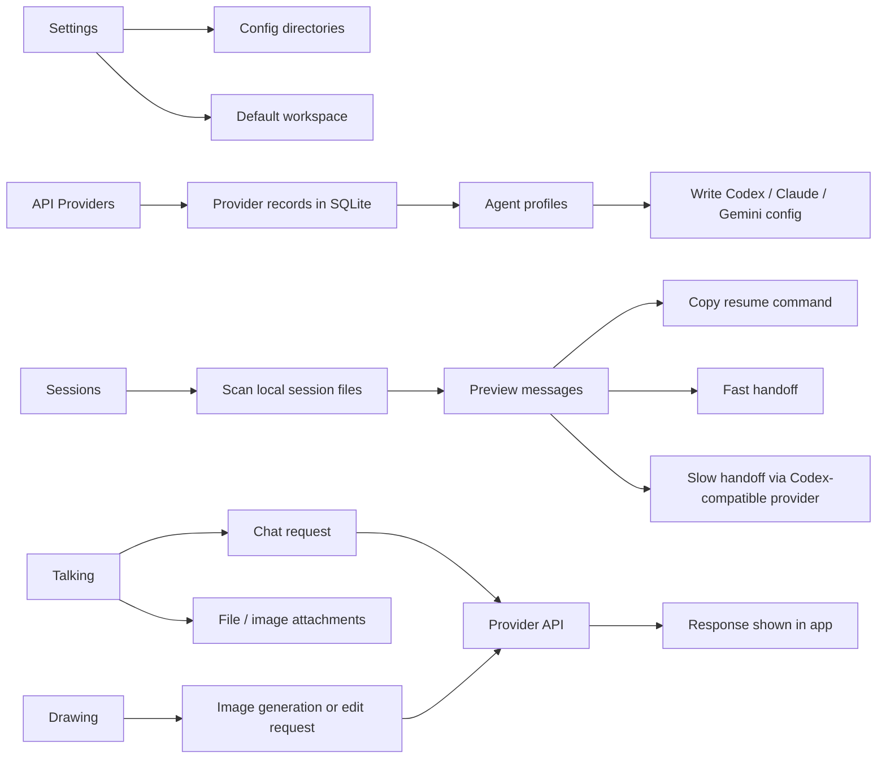

# Codex Switch

Codex Switch is a Windows desktop app for managing AI provider settings and local coding-agent sessions for Codex, Claude Code, and Gemini.

The project is built with Tauri, React, TypeScript, Rust, SQLite, and Vite. It is mainly a personal workflow tool and learning project, so review the code before using important credentials.

## What It Does

- Manage API providers and agent-specific provider profiles.
- Switch the active provider used by Codex, Claude Code, or Gemini.
- Write the selected provider configuration into local agent config directories.
- Browse local Codex, Claude Code, and Gemini session files.
- Copy session resume commands.
- Build Fast or Slow handoff text for continuing a previous coding session.
- Use a Talking page for direct chat with configured providers.
- Attach text files, code files, or images in the Talking page.
- Use a Drawing page for OpenAI-compatible image generation and image editing endpoints.
- Download generated images from the Drawing page.
- Build Windows `.msi` and `.exe` installers with Tauri.

## App Flow



## How It Is Implemented

### Desktop Shell

- Tauri provides the Windows desktop shell, tray menu, native window, file/folder picker, and Rust command bridge.
- React and TypeScript render the UI.
- Vite builds the frontend.

### Local Data

- Provider settings, agent profiles, and app settings are stored in a local SQLite database at `~/.codex-switch/codex-switch.db`.
- Talking topics and Drawing records are currently stored in browser `localStorage`.
- Drawing image results are stored as returned URLs or base64 data in Drawing records. They are not saved as image files until the user downloads them.

### Provider Switching

- The Providers and Agents pages edit local provider records.
- When a provider profile is activated, Rust writes the matching config text into the configured Codex, Claude Code, or Gemini config directory.
- The tray menu is rebuilt after provider changes so the active provider can be switched from the tray.

### Session Browser and Handoff

- Rust scans local session files from configured Codex paths and default Claude Code / Gemini locations.
- Session rows show parsed metadata and message previews.
- Fast handoff is generated locally from parsed session content.
- Slow handoff sends a summary request through the active Codex-compatible provider and copies the generated continuation text.

### Talking Page

- The Talking page keeps topic history in `localStorage`.
- Chat requests are sent through Tauri commands to provider APIs.
- Text and code files are converted into readable prompt text.
- Images are sent using provider-specific multimodal request shapes where supported.
- Large base64 attachment data is not persisted into `localStorage`; stored history only keeps attachment metadata.

### Drawing Page

- The Drawing page calls OpenAI-compatible image endpoints:
  - `images/generations` for normal image generation.
  - `images/edits` when input images are attached in Edit mode.
- The page shows a generating animation while waiting for a response.
- Clicking a generated image opens a larger viewer with zoom, pan, copy, and download controls.

## Current Limitations

- The app is Windows-first.
- API keys are stored locally in SQLite; this project does not add its own encryption layer.
- Drawing is wired for OpenAI-compatible image endpoints. Anthropic and Gemini image generation are not implemented in the Drawing page.
- Talking image attachments depend on the selected provider and model supporting image input.
- Talking and Drawing histories use `localStorage`, so very large histories should be cleaned manually if needed.
- The app does not replace the official Codex, Claude Code, or Gemini tools; it only manages local settings and helper workflows around them.

## Install

Download the latest Windows installer from GitHub Releases:

https://github.com/baosen-h/codex-switch/releases/latest

The `v0.1.4` release includes:

- Windows MSI installer.
- Windows setup EXE installer.
- Standalone release EXE.

## Basic Use

1. Open Codex Switch.
2. Go to Settings and confirm the config directories.
3. Add or enable API providers.
4. Create agent profiles for Codex, Claude Code, or Gemini.
5. Activate the provider profile you want to use.
6. Use Sessions to inspect previous local sessions and copy resume or handoff text.
7. Use Talking or Drawing when you want a direct chat or image workflow inside the app.

## Local Development

Requirements:

- Node.js 20+
- Rust stable toolchain
- Windows WebView2 runtime

Install dependencies:

```bash
npm install
```

Run in development:

```bash
npm run tauri dev
```

Build frontend only:

```bash
npm run build
```

Build Windows app and installers:

```bash
npm run tauri build
```

Generated installers are written under:

```text
src-tauri/target/release/bundle/msi/
src-tauri/target/release/bundle/nsis/
```

## Release Checklist

1. Update version fields in:
   - `package.json`
   - `package-lock.json`
   - `src-tauri/Cargo.toml`
   - `src-tauri/Cargo.lock`
   - `src-tauri/tauri.conf.json`
2. Run:

```bash
npm run build
cargo check --manifest-path src-tauri/Cargo.toml
npm run tauri build
```

3. Commit the release.
4. Tag the release, for example:

```bash
git tag v0.1.4
git push origin main
git push origin v0.1.4
```

5. Upload the generated MSI and setup EXE to the GitHub Release.

## Suggested README Image Prompt

Use this prompt if you want to generate a single overview image for the README. Save the result as something like `docs/codex-switch-overview.png`, then add it near the top of this README.

```text
Create a clean product overview image for a Windows desktop app named "Codex Switch".

The image should explain the app workflow, not look like a marketing poster.

Style:
- crisp modern desktop-app documentation graphic
- dark UI theme with subtle blue accents
- simple flat/vector UI mockup, no exaggerated effects
- readable labels, clear spacing, 16:9 aspect ratio

Content:
- show one main desktop window titled "Codex Switch"
- left sidebar with these pages: Providers, Agents, Talking, Drawing, Sessions, Settings
- center area split into four clear workflow panels:
  1. Provider setup: API Provider -> Agent Profile -> Local Config
  2. Sessions: Local Session Files -> Preview -> Resume / Handoff
  3. Talking: Prompt + File/Image Attachments -> Provider API -> Reply
  4. Drawing: Prompt or Input Image -> Image API -> Generated Image Viewer
- show small arrows between steps
- include a small local storage/database icon labeled "SQLite + localStorage"

Text must be short and readable. Do not invent features like team sync, cloud hosting, collaboration, analytics, or marketplace.
No logos from real AI companies unless they are generic placeholders.
No screenshots of a real product. Make it a documentation-style app workflow diagram.
```

After generating the image, add it with:

```markdown

```

## License

MIT. See `LICENSE`.
