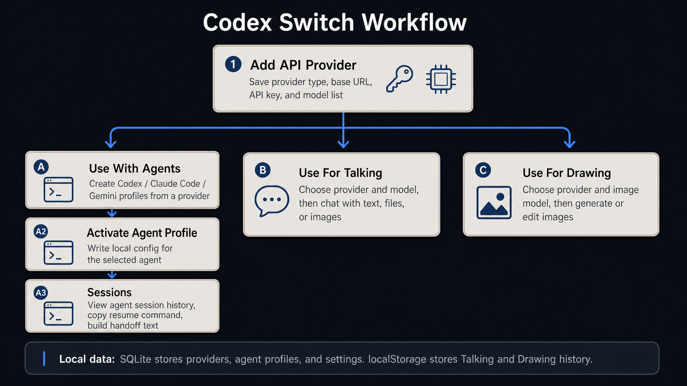

# Codex Switch

[](https://github.com/baosen-h/codex-switch/releases)
[](https://github.com/baosen-h/codex-switch/releases)
[](LICENSE)

Codex Switch is a Windows desktop tool for connecting API providers with three local workflows: coding agents, direct chat, and image generation.

It is built with **Tauri**, **React**, **TypeScript**, **Rust**, **SQLite**, and **Vite**.

> This is a local helper app. It manages provider records, writes local agent configs, and keeps lightweight local history. It is not a replacement for Codex, Claude Code, or Gemini.

## Workflow

Configure a provider once, then reuse it in Agents, Talking, or Drawing. Sessions are used for local agent history.

<p align="center">
  
</p>

## Screenshots

### API Providers

Save provider type, base URL, API key, website, and model list. These provider records are reused by the other pages.


### Agents

Create Codex, Claude Code, or Gemini profiles from a provider. Activating a profile writes the selected config to the local agent config directory.


### Talking

Choose a provider and model, then chat with text, files, or images when the selected model supports them.


### Drawing

Choose a provider and image model to generate or edit images. Results can be opened larger, copied, and downloaded.


### Light Mode

The app supports both dark and light background modes.


## Features

- API provider management for OpenAI-compatible, OpenAI, Anthropic, Gemini, Ollama, New API, OpenRouter, and Hugging Face style records.
- Agent profiles for Codex, Claude Code, and Gemini.
- One-click activation that writes local agent config.
- Local session browser with transcript preview, resume command copy, and handoff text generation.
- Talking page for direct chat through configured providers.
- File and image attachments in Talking.
- Drawing page for OpenAI-compatible image generation and image editing endpoints.
- Windows `.msi`, setup `.exe`, and standalone `.exe` builds.

## Install

Download the latest Windows release:

https://github.com/baosen-h/codex-switch/releases/latest

Release assets usually include:

- `Codex.Switch_VERSION_x64-setup.exe`
- `Codex.Switch_VERSION_x64_en-US.msi`
- `codex-switch.exe`

## Local Data

- SQLite stores providers, agent profiles, session metadata, and settings at `~/.codex-switch/codex-switch.db`.
- Talking and Drawing history are stored in browser `localStorage`.
- Generated drawing images are stored as returned URLs or base64 data until downloaded.

## Limitations

- Windows-first.
- API keys are stored locally in SQLite without an extra encryption layer.
- Drawing focuses on OpenAI-compatible image endpoints.
- Talking image input depends on provider and model support.

## Development

Requirements:

- Node.js 20+
- Rust stable toolchain
- Windows WebView2 runtime

```bash
npm install
npm run tauri dev
```

Build:

```bash
npm run build
npm run tauri build
```

Installer output:

```text
src-tauri/target/release/bundle/msi/
src-tauri/target/release/bundle/nsis/
```

## License

MIT. See [LICENSE](LICENSE).
