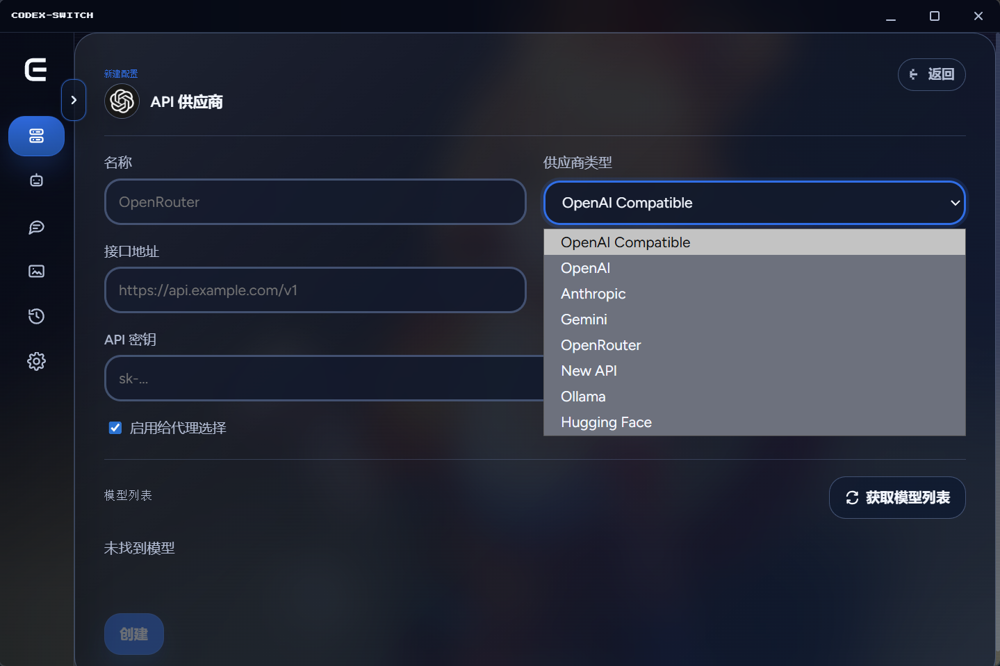
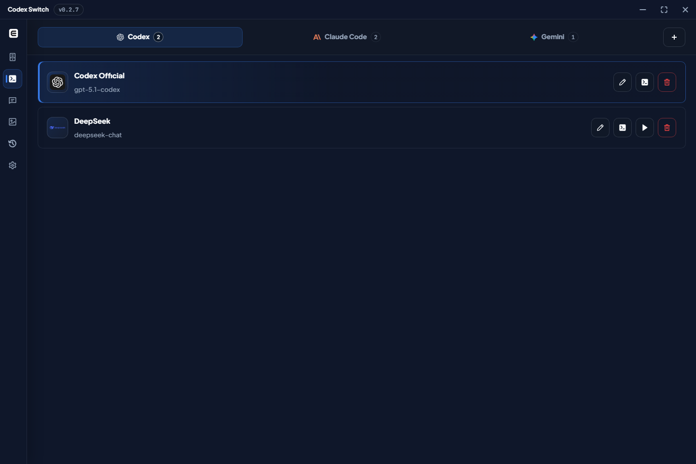
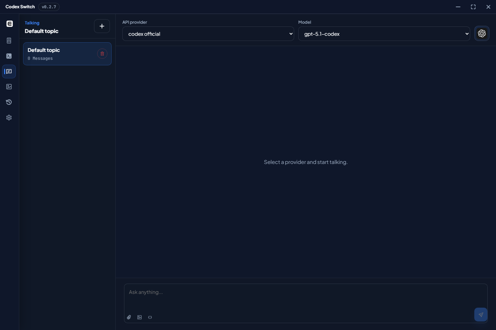
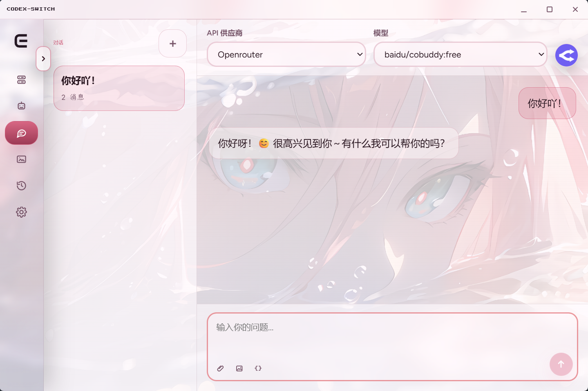
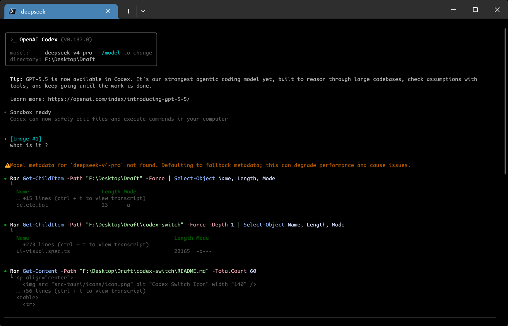
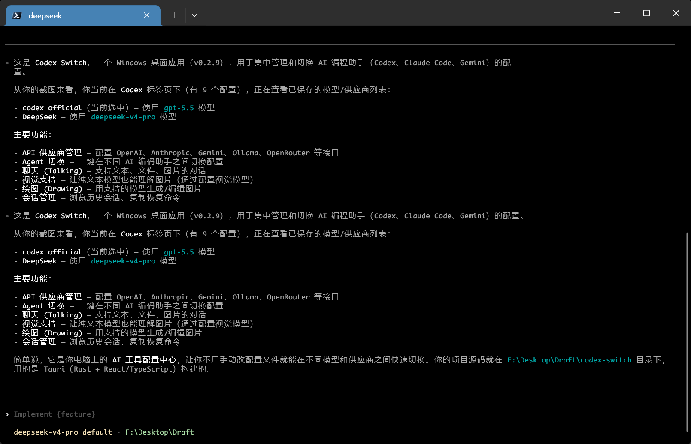

<p align="center">
  
</p>

<h1 align="center">Codex Switch</h1>

<p align="center">
  English · <a href="README.zh-CN.md">简体中文</a>
</p>

<p align="center">
  <a href="https://github.com/baosen-h/codex-switch/releases"></a>
  <a href="https://github.com/baosen-h/codex-switch/releases"></a>
  <a href="LICENSE"></a>
</p>

Codex Switch is a Windows desktop app for managing Codex, Claude Code, and Gemini provider configs, plus chat, image generation, and local sessions. Built-in chat/completion translation helps Codex work with compatible models like DeepSeek, MiMo, and GLM, while configurable vision model support enables text-only models to understand images.

## Highlights

- API Providers: manage OpenAI, OpenAI Compatible / New API, Anthropic Compatible, Gemini, Ollama, OpenRouter, and Hugging Face records.
- Codex compatibility: translate chat/completion providers such as DeepSeek, MiMo, and GLM for Codex.
- Agents: generate Codex, Claude Code, and Gemini configs from provider records.
- Talking: chat with text, files, and images when the selected model supports them.
- Vision model support: let text-only models, such as text-only DeepSeek and GLM variants, understand images through a configurable vision model in Talking, Codex CLI, Claude Code, and Gemini CLI.
- Drawing: generate and edit images with supported models.
- Sessions: inspect local sessions, preview transcripts, copy resume commands, and generate handoff text.
- Settings: switch theme, background, directories, terminal, and release page access.

## Screenshots

<table>
  <tr>
    <th align="center">Providers</th>
    <th align="center">Agents</th>
  </tr>
  <tr>
    <td></td>
    <td></td>
  </tr>
  <tr>
    <td align="center"><sub>Manage OpenAI, OpenAI-compatible, Anthropic-compatible, Gemini, and other provider records.</sub></td>
    <td align="center"><sub>Generate and switch Codex, Claude Code, and Gemini configs from saved providers.</sub></td>
  </tr>
  <tr>
    <th align="center">Talking</th>
    <th align="center">Drawing</th>
  </tr>
  <tr>
    <td></td>
    <td></td>
  </tr>
  <tr>
    <td align="center"><sub>Chat with models that support text, files, and image input.</sub></td>
    <td align="center"><sub>Generate and edit images with supported image models.</sub></td>
  </tr>
</table>

<table>
  <tr>
    <th align="center">Settings</th>
  </tr>
  <tr>
    <td></td>
  </tr>
  <tr>
    <td align="center"><sub>Configure directories, language, theme, background, updates, and session recording.</sub></td>
  </tr>
</table>

<table>
  <tr>
    <th colspan="2" align="center">Vision Model Support in Codex CLI</th>
  </tr>
  <tr>
    <td width="50%"></td>
    <td width="50%"></td>
  </tr>
  <tr>
    <td align="center"><sub>Send an image to a text-only DeepSeek model in Codex CLI.</sub></td>
    <td align="center"><sub>MiMo-V2.5 provides the image information, allowing DeepSeek to answer.</sub></td>
  </tr>
</table>

## Install

Download the latest Windows release:

https://github.com/baosen-h/codex-switch/releases/latest

## Build

```bash
npm install
npm run build
npm run tauri -- build
```

## Notes

- Windows-first.
- API keys are stored locally in SQLite.
- Drawing is focused on OpenAI-compatible image endpoints.
- Vision model support only lists models verified to accept image input and return text.

## License

MIT. See [LICENSE](LICENSE).
