<p align="center">
  
</p>

<h1 align="center">Codex Switch</h1>

<p align="center">
  English · <a href="README.zh-CN.md">Simplified Chinese</a>
</p>

<p align="center">
  <a href="https://github.com/baosen-h/codex-switch/releases"></a>
  <a href="https://github.com/baosen-h/codex-switch/releases"></a>
  <a href="LICENSE"></a>
</p>

## Product Introduction

Codex Switch manages AI providers, agents, chat, drawing, sessions, MCP, Skills, vision fallback, and web search on Windows.

The app writes the native config files those agents already use, while a local compatibility proxy on `127.0.0.1:47632` fills the protocol gaps when a provider does not match the target runtime. That is how chat-completion providers such as DeepSeek, MiMo, and GLM can be used from Codex-style workflows, how text-only models can receive image descriptions from a configured vision model, and how models without native web search can call local `web__search` and `web__fetch` tools.

All provider records and capability metadata stay on the machine in local storage. API keys are not sent to a hosted Codex Switch service.

## Highlights

- API Providers: manage OpenAI, OpenAI Compatible / New API, Anthropic Compatible, Gemini, Ollama, OpenRouter, Hugging Face, DeepSeek, MiMo, GLM, and other records.
- Agents: generate and switch Codex, Claude Code, and Gemini runtime configs from saved provider records.
- Talking: chat with text, files, and images when the selected model supports them.
- Drawing: generate and edit images with supported OpenAI-compatible image endpoints.
- Sessions: inspect local sessions, preview transcripts, copy resume commands, generate handoff text, and repair hidden Codex sessions.
- Vision fallback: let text-only models such as DeepSeek, MiMo, and GLM understand image input through a configured vision model.
- Automatic web search: add local `web__search` and `web__fetch` tools for models or providers, such as DeepSeek, MiMo, and GLM, that do not have native web search.
- Capabilities: discover, test, install, and sync MCP servers and Skills across Codex, Claude Code, and Gemini.
- Settings: configure directories, terminal, language, theme, background, release access, vision fallback, and web search.

## Screenshots

<table>
  <tr>
    <th align="center">Providers</th>
    <th align="center">Agents</th>
  </tr>
  <tr>
    <td>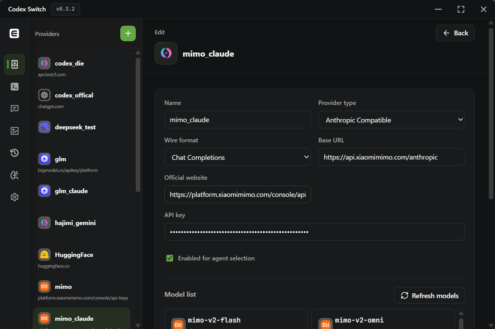</td>
    <td>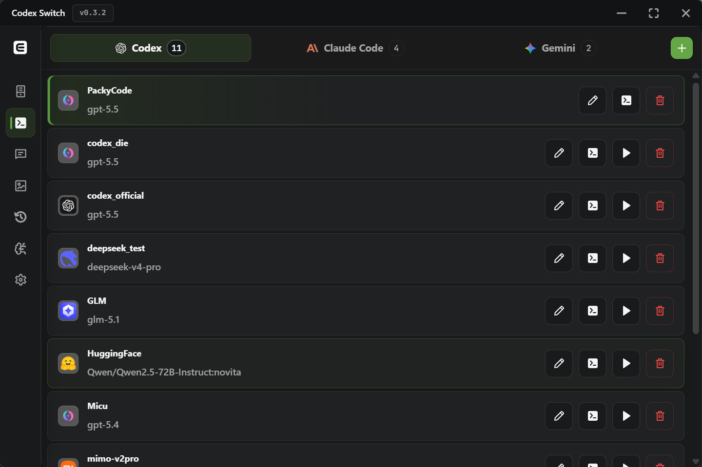</td>
  </tr>
  <tr>
    <td align="center"><sub>Manage provider records, keys, base URLs, model discovery, and provider websites.</sub></td>
    <td align="center"><sub>Generate Codex, Claude Code, and Gemini profiles from saved providers.</sub></td>
  </tr>
  <tr>
    <th align="center">Talking</th>
    <th align="center">Drawing</th>
  </tr>
  <tr>
    <td>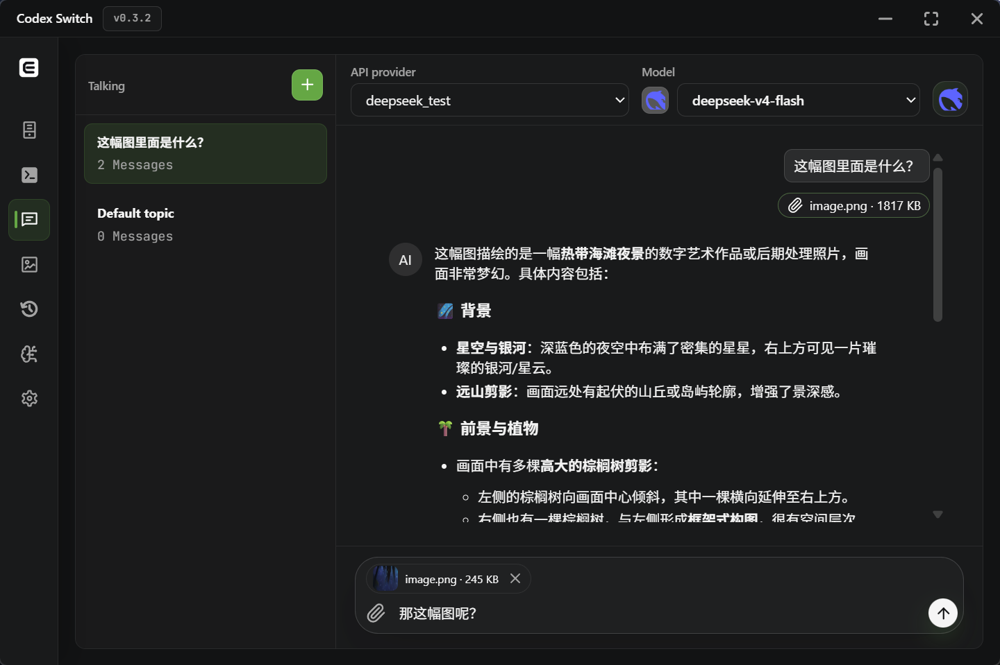</td>
    <td>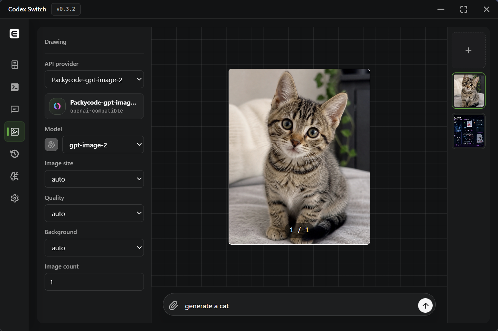</td>
  </tr>
  <tr>
    <td align="center"><sub>Chat with models using text, files, images, and automatic tool support.</sub></td>
    <td align="center"><sub>Generate and edit images with compatible image models.</sub></td>
  </tr>
  <tr>
    <th align="center">Sessions</th>
    <th align="center">Settings</th>
  </tr>
  <tr>
    <td>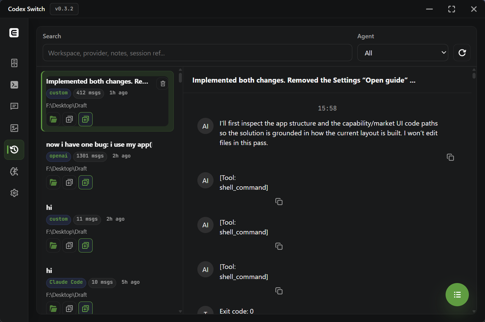</td>
    <td>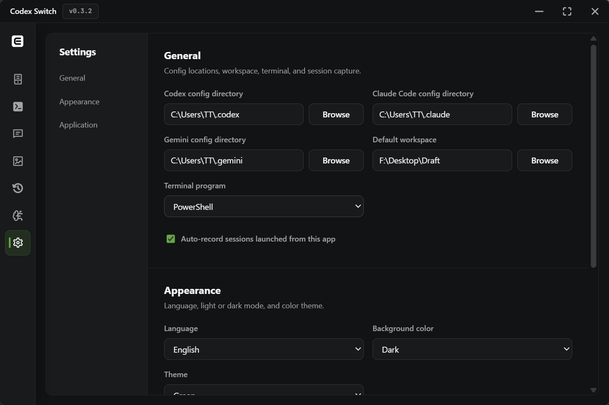</td>
  </tr>
  <tr>
    <td align="center"><sub>Browse local transcripts, copy resume or handoff commands, and restore hidden Codex sessions with Repair Visibility.</sub></td>
    <td align="center"><sub>Configure app paths, appearance, updates, vision fallback, and web search.</sub></td>
  </tr>
</table>

<table>
  <tr>
    <th align="center">Vision Fallback</th>
    <th align="center">Web Search</th>
  </tr>
  <tr>
    <td>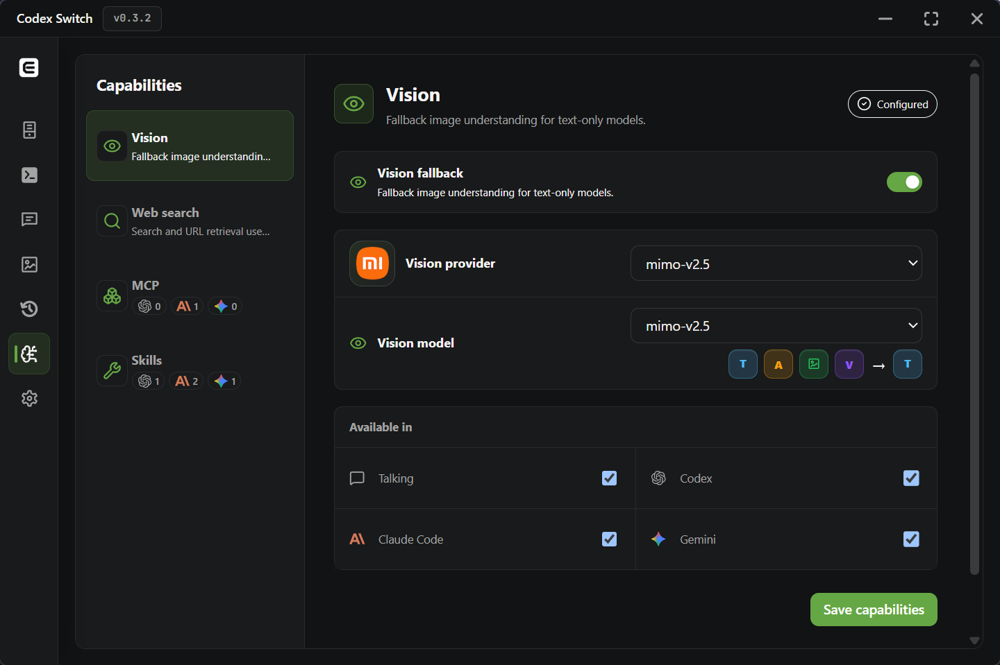</td>
    <td>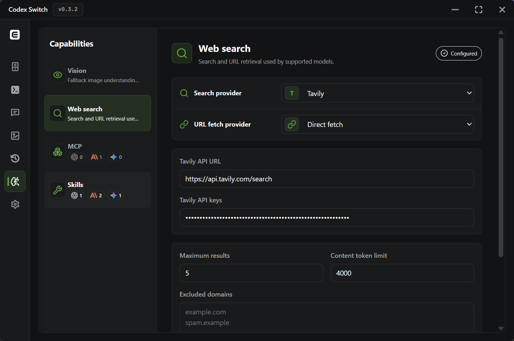</td>
  </tr>
  <tr>
    <td align="center"><sub>Route image understanding through a configured vision provider for text-only models.</sub></td>
    <td align="center"><sub>Configure search and fetch providers for model-driven web access.</sub></td>
  </tr>
  <tr>
    <th align="center">MCP Servers</th>
    <th align="center">Skills</th>
  </tr>
  <tr>
    <td>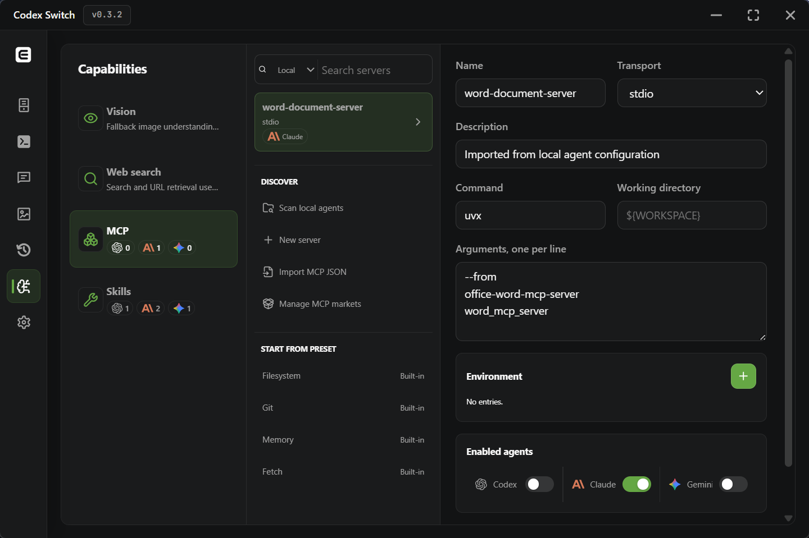</td>
    <td>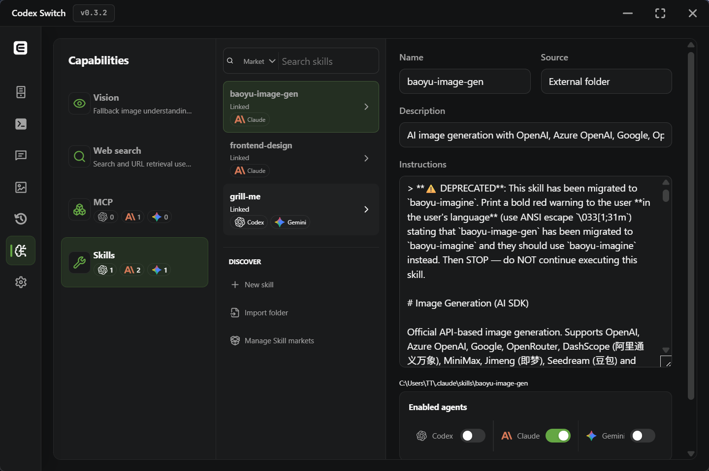</td>
  </tr>
  <tr>
    <td align="center"><sub>Discover, test, install, and sync MCP servers across supported agents.</sub></td>
    <td align="center"><sub>Discover, review, install, and sync Skills across supported agents.</sub></td>
  </tr>
</table>

<table>
  <tr>
    <th align="center">CLI Vision Input</th>
    <th align="center">CLI Vision Output</th>
  </tr>
  <tr>
    <td></td>
    <td>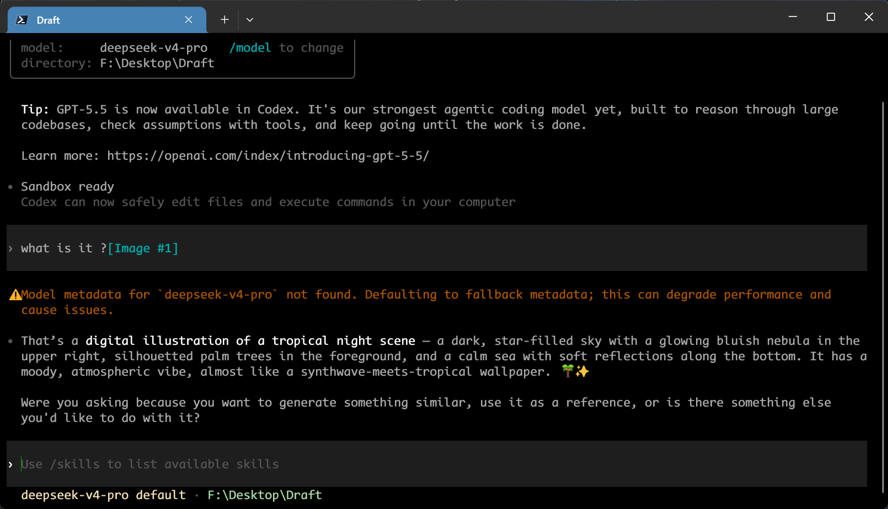</td>
  </tr>
  <tr>
    <td align="center"><sub>Send image context from the CLI through the local vision fallback pipeline.</sub></td>
    <td align="center"><sub>Text-only models receive structured image descriptions before answering.</sub></td>
  </tr>
  <tr>
    <th align="center">CLI Web Search Request</th>
    <th align="center">CLI Web Search Result</th>
  </tr>
  <tr>
    <td>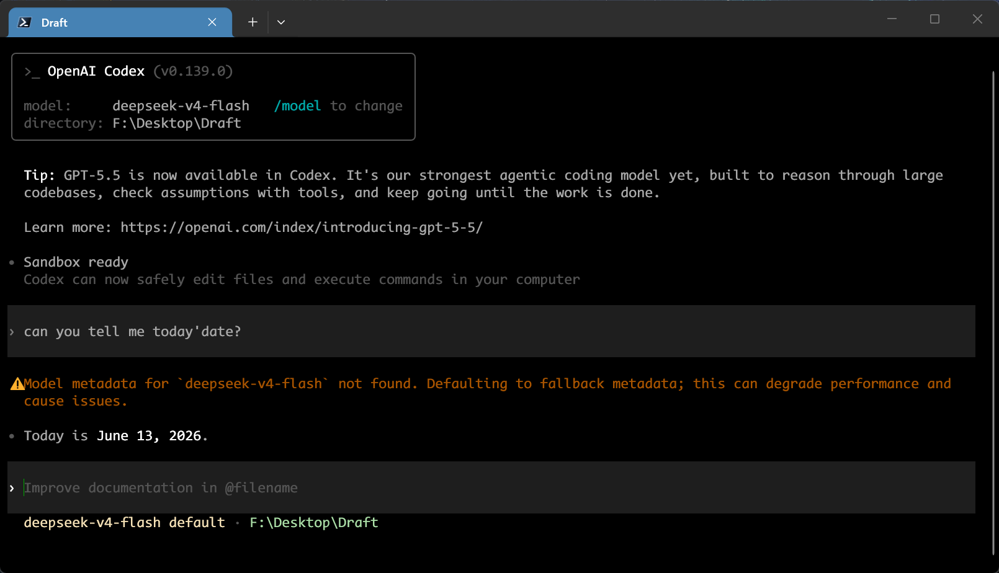</td>
    <td>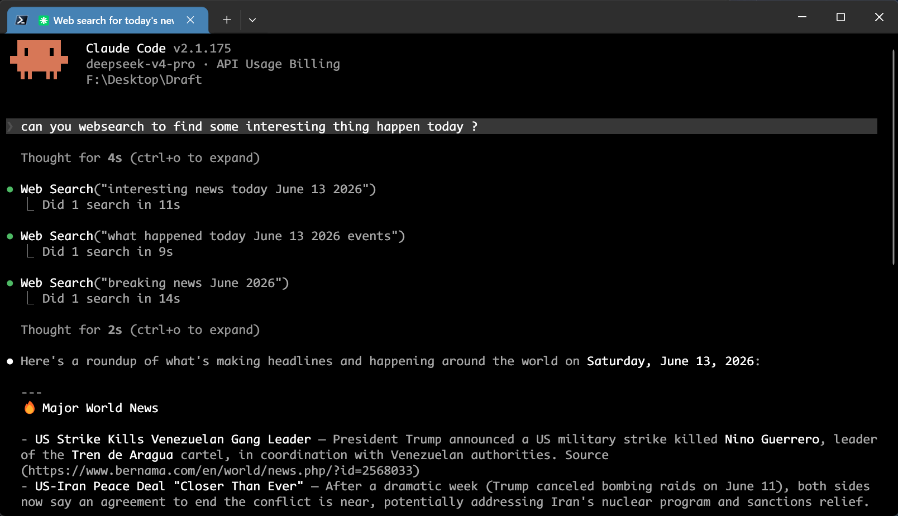</td>
  </tr>
  <tr>
    <td align="center"><sub>Models without native web search can call local `web__search` and `web__fetch` tools.</sub></td>
    <td align="center"><sub>The compatibility proxy returns source context to the model for the final answer.</sub></td>
  </tr>
</table>

<table>
  <tr>
    <th align="center">Modes</th>
    <th align="center">Themes</th>
  </tr>
  <tr>
    <td>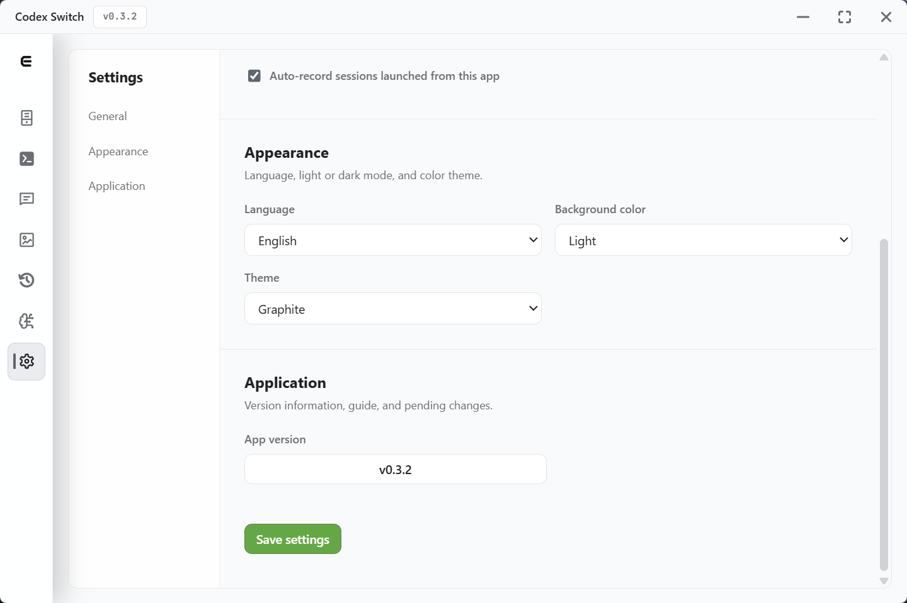</td>
    <td>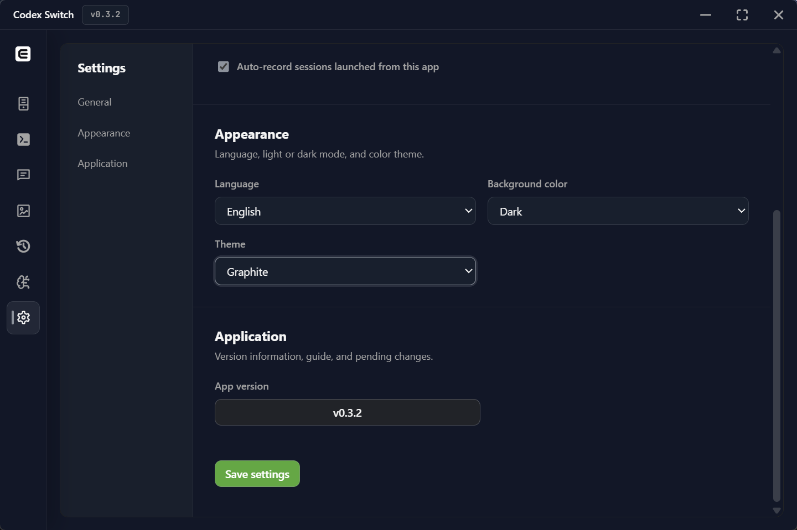</td>
  </tr>
</table>

## How It Works

### Architecture Flow

```text
React feature pages
Providers / Agents / Talking / Drawing / Capabilities / Settings
        |
        v
src/api/tauri.ts appApi
        |
        v
Tauri invoke(...)
        |
        v
src-tauri/src/commands.rs
        |
        +--> database.rs            -> local SQLite app state
        +--> agent_writer.rs        -> Codex / Claude / Gemini config files
        +--> compatibility_proxy.rs -> runtime bridge on 127.0.0.1:47632
        +--> capabilities.rs        -> MCP + Skill discovery, testing, sync
        +--> provider APIs          -> chat, model list, image generation, OAuth
```

The frontend keeps pages and form state in React. `src/api/tauri.ts` is the only bridge to Rust commands, so new contributors can follow a feature by starting at its page, finding the matching `appApi` method, and then reading the Tauri command implementation.

### Provider

```text
ProvidersPage.tsx
        |
        v
appApi.saveApiProvider / listProviderModels / startOpenAiOauth
        |
        v
commands.rs
        |
        +--> database.save_api_provider  -> reusable local record
        +--> remote model list / OAuth   -> optional provider metadata
        +--> active linked Agent refresh -> agent_writer when auth changes
```

Provider records are reusable API connection profiles. The frontend owns provider editing, model discovery, OAuth entry points, website links, and local form state. The backend stores providers in the local SQLite database and keeps API keys on the local machine. Provider presets and normalization keep OpenAI-compatible, Anthropic-compatible, Gemini, Ollama, OpenRouter, Hugging Face, and other providers under one UI model.

### Agent

```text
AgentsPage.tsx
        |
        v
appApi.saveProvider / activateProvider
        |
        v
commands.rs -> database.save_provider / activate_provider
        |
        v
agent_writer::write_provider
        |
        +--> Codex  -> ~/.codex/config.toml + ~/.codex/auth.json
        +--> Claude -> ~/.claude/settings.json
        +--> Gemini -> ~/.gemini/settings.json + ~/.gemini/.env
        |
        v
tray refresh + current runtime profile
```

Agent profiles bind a saved provider to a runtime target: Codex, Claude Code, or Gemini. When a profile is activated, Codex Switch writes the target tool's config using the selected provider, model, base URL, reasoning options, and extra config fields. If a non-native provider needs protocol translation or fallback capabilities, the generated config points the agent to the local proxy path for that runtime.

### Chat

```text
TalkingPage.tsx
        |
        v
appApi.sendChatMessage
        |
        v
commands::send_chat_message
        |
        +--> optional vision_fallback::preprocess_chat_messages
        |
        v
send_chat_message_blocking
        |
        +--> Anthropic-compatible -> /messages
        +--> Gemini               -> :generateContent
        +--> OpenAI-compatible    -> /chat/completions
        +--> OpenAI-compatible + configured web search
             -> web__search / web__fetch loop, max 8 tool steps
```

Talking sends messages through the selected provider and model, preserving files and image attachments when the model supports them. For text-only models with vision fallback enabled, image attachments are first converted into text descriptions by the configured vision provider. When an OpenAI-compatible model or provider does not have native web search, such as DeepSeek, MiMo, or GLM, Codex Switch can run local `web__search` and `web__fetch` tool calls before returning the final answer.

### Drawing

```text
DrawingPage.tsx
        |
        v
appApi.generateImage
        |
        v
commands::generate_image
        |
        +--> prompt only          -> /images/generations JSON
        +--> prompt + input image -> /images/edits multipart
        |
        v
extract_images -> persist_generated_images
        |
        v
local drawing image files + Drawing record rail
```

Drawing focuses on OpenAI-compatible image endpoints. Anthropic-compatible and Gemini providers are rejected in this page because their image generation routes are not wired here. The feature keeps prompt state, provider/model selection, generation/edit requests, local records, saved image paths, and image zoom behavior inside the Drawing feature boundary.

### Compatibility Proxy

```text
Codex / Claude Code / Gemini CLI
        |
        v
generated config points to local gateway when needed
        |
        v
127.0.0.1:47632
        |
        v
compatibility_proxy::handle_connection
        |
        +--> /v1/models        -> synthetic current model list
        +--> /v1/responses     -> native Responses API or relay_translate to Chat
        +--> /anthropic/...    -> Anthropic-compatible gateway
        +--> /gemini/...       -> Gemini-compatible gateway
        |
        v
vision_fallback and local web tools are applied before upstream calls when enabled
```

Codex Switch starts a local in-process proxy on `127.0.0.1:47632`. Each request is matched to the current provider for the target agent. Codex `/v1/responses` requests either pass through to a Responses-capable provider or use `relay_translate` to call `/chat/completions` and translate the result back. Claude and Gemini gateway paths let those CLIs use the same configured provider and fallback logic.

### Vision Capability

```text
settings + provider model metadata
        |
        v
vision_fallback::model_vision_capability
        |
        +--> Vision or Unknown -> keep original image request
        |
        +--> TextOnly + enabled toggle
             |
             v
preprocess_chat_messages / preprocess_codex_body
preprocess_anthropic_body / preprocess_gemini_body
             |
             v
describe_image with configured vision provider, max 6 images, cached descriptions
             |
             v
replace image parts with <vision-analysis> text before main model call
```

Vision fallback is used only when the main model is detected as text-only and the corresponding Talking, Codex, Claude, or Gemini toggle is enabled. This lets text-only models such as DeepSeek, MiMo, and GLM understand images through a configured vision model. Descriptions are cached by image and prompt to avoid repeated vision calls.

### Web Search Capability

```text
model without native web search
        |
        v
web__search / web__fetch tool call
        |
        v
commands.rs or compatibility_proxy.rs
        |
        v
web_search.rs
        |
        +--> search providers: Tavily / Zhipu / Exa / Bocha / SearXNG / Jina
        +--> fetch providers: direct fetcher / Jina Reader
        |
        v
numbered source JSON returned to the model for final answer
```

Automatic web search is configured once in Settings for models or providers that need local web access, such as DeepSeek, MiMo, or GLM. Supported search providers include Tavily, Zhipu, Exa, Bocha, SearXNG, and Jina. Fetching can use the built-in direct fetcher or Jina Reader. Direct fetching validates redirects, blocks private and reserved network addresses, accepts readable text formats only, and limits responses to 10 MB.

### MCP Capability

```text
CapabilitiesPage.tsx
        |
        v
appApi.getCapabilitiesState / saveMcpServer / testMcpServer / syncMcpCapabilities
        |
        v
commands.rs -> capabilities.rs
        |
        +--> discover Codex config.toml, Claude .claude.json, Gemini settings.json
        +--> save to SQLite, redact secret values in UI, secure secrets with keyring
        +--> test stdio / HTTP / SSE server definitions
        +--> sync_mcp_agent writes target agent config format
```

The Capabilities page discovers MCP servers from Codex, Claude Code, and Gemini config files. Servers can be stored, tested, assigned to target agents, and synced back to the target config format. Secret values are redacted in the UI and stored through the operating system keychain where needed.

### Skill Capability

```text
CapabilitiesPage.tsx
        |
        v
appApi.importSkill / saveSkill / searchMarketplace / installMarketplaceSkill
        |
        v
commands.rs -> capabilities.rs / marketplace.rs
        |
        +--> discover SKILL.md roots in Codex, Claude, Gemini, and ~/.agents/skills
        +--> write app-managed or external SKILL.md files
        +--> hide built-in system skills from normal management
        +--> sync_skill_agent mirrors selected skills to target agents
```

Codex Switch discovers local Skills from Codex, Claude Code, Gemini, and shared agent skill roots. Built-in system skills are hidden from normal management, while external skills can be reviewed and synced across targets. Marketplace installs remain pinned until the user explicitly updates them.

## Install

Download the latest Windows release:

https://github.com/baosen-h/codex-switch/releases/latest

## Build

```bash
npm install
npm run build
npm run tauri -- build
```

## Development

- Frontend architecture and contribution rules: [docs/frontend-architecture.md](docs/frontend-architecture.md)
- Feature ownership rules: [src/features/README.md](src/features/README.md)

## Notes

- Windows-first.
- API keys are stored locally.
- Drawing is focused on OpenAI-compatible image endpoints.
- Vision fallback only lists models verified to accept image input and return text.

## Feedback & Support

- Found a problem? [Submit an Issue](https://github.com/baosen-h/codex-switch/issues/new).
- Contributions are welcome. [Open a Pull Request](https://github.com/baosen-h/codex-switch/pulls) to help improve the project.

## License

MIT. See [LICENSE](LICENSE).
