<p align="center">
  
</p>

<h1 align="center">Codex Switch</h1>

<p align="center">
  <a href="README.md">English</a> · 简体中文
</p>

<p align="center">
  <a href="https://github.com/baosen-h/codex-switch/releases"></a>
  <a href="https://github.com/baosen-h/codex-switch/releases"></a>
  <a href="LICENSE"></a>
</p>

## 产品介绍

Codex Switch 是一个面向本地 AI Agent 运行环境的 Windows 桌面控制面板。它把可复用 API Provider、Codex / Claude Code / Gemini Agent 配置、Talking、Drawing、本地会话、MCP 服务、Skills、视觉回退和联网搜索统一在一个本地应用里管理。

应用会写入这些 Agent 原本使用的原生配置文件；当服务商协议和目标运行时不匹配时，会通过 `127.0.0.1:47632` 上的本地兼容代理补齐协议差异。因此 DeepSeek、MiMo、GLM 等 chat-completion 服务商可以进入 Codex 风格工作流；纯文本模型可以通过配置的视觉模型获得图片描述；没有原生联网搜索能力的模型也可以调用本地 `web__search` 和 `web__fetch` 工具。

Provider 记录和能力配置都保存在本机。API Key 不会发送到任何 Codex Switch 托管服务。

## 重点功能

- API Providers：管理 OpenAI、OpenAI Compatible / New API、Anthropic Compatible、Gemini、Ollama、OpenRouter、Hugging Face、DeepSeek、MiMo、GLM 等服务商记录。
- Agents：根据已保存的 Provider 记录生成并切换 Codex、Claude Code 和 Gemini 运行配置。
- Talking：在模型支持时进行文本、文件和图片对话。
- Drawing：使用兼容 OpenAI 图片接口的模型生成和编辑图片。
- Sessions：查看本地会话、预览 transcript、复制 resume 命令、生成 handoff 文本，并修复被隐藏的 Codex 会话。
- 视觉回退：通过配置的视觉模型，让 DeepSeek、MiMo、GLM 等纯文本模型也能理解图片输入。
- 自动联网搜索：为 DeepSeek、MiMo、GLM 等没有原生联网搜索能力的模型或服务商提供本地 `web__search` 和 `web__fetch` 工具。
- Capabilities：发现、测试、安装并同步 Codex、Claude Code 和 Gemini 的 MCP 服务与 Skills。
- Settings：配置目录、终端、语言、主题、背景、发布页入口、视觉回退和联网搜索。

## 截图

<table>
  <tr>
    <th align="center">Providers</th>
    <th align="center">Agents</th>
  </tr>
  <tr>
    <td>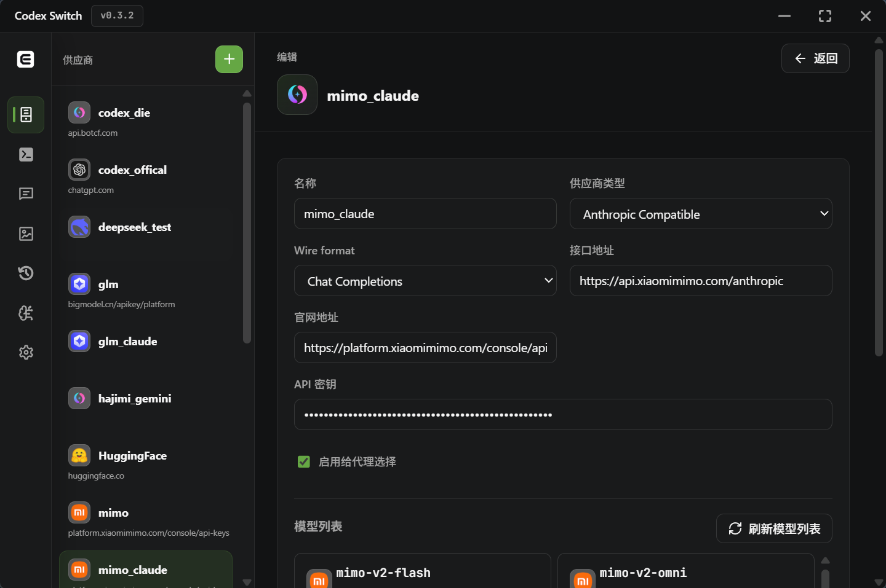</td>
    <td>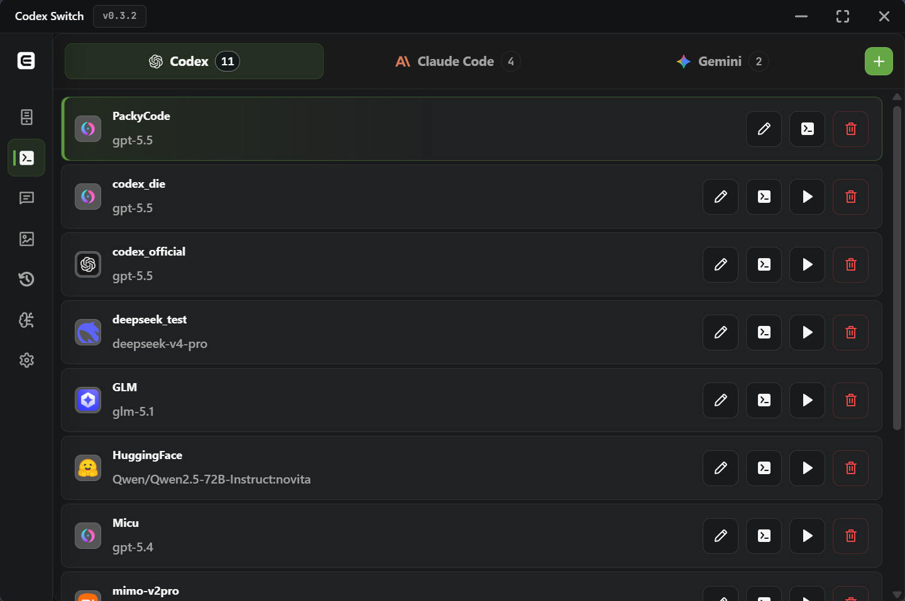</td>
  </tr>
  <tr>
    <td align="center"><sub>管理服务商记录、密钥、Base URL、模型发现和官网入口。</sub></td>
    <td align="center"><sub>根据已保存服务商生成 Codex、Claude Code 和 Gemini 配置。</sub></td>
  </tr>
  <tr>
    <th align="center">Talking</th>
    <th align="center">Drawing</th>
  </tr>
  <tr>
    <td>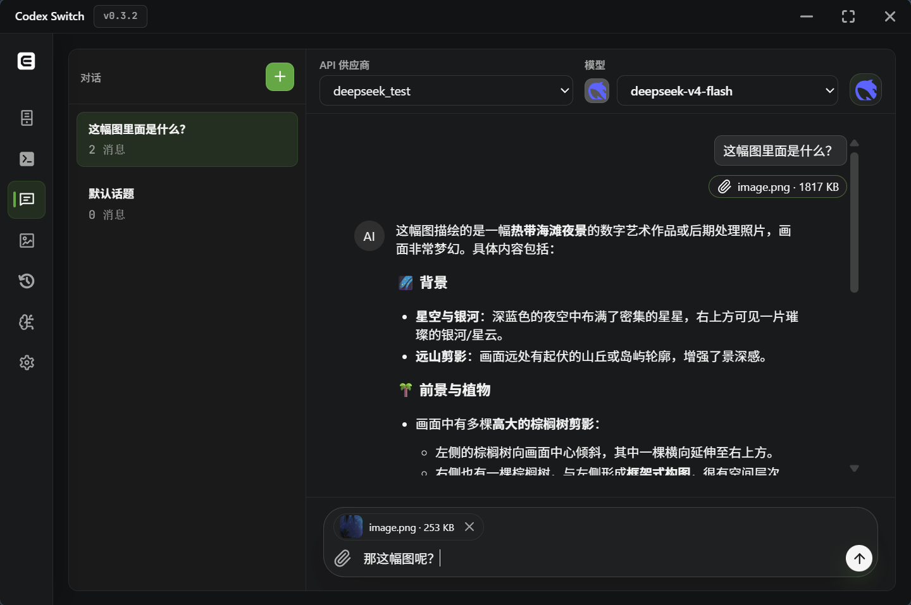</td>
    <td></td>
  </tr>
  <tr>
    <td align="center"><sub>使用文本、文件、图片和自动工具支持与模型对话。</sub></td>
    <td align="center"><sub>使用兼容图片模型生成和编辑图片。</sub></td>
  </tr>
  <tr>
    <th align="center">Sessions</th>
    <th align="center">Settings</th>
  </tr>
  <tr>
    <td>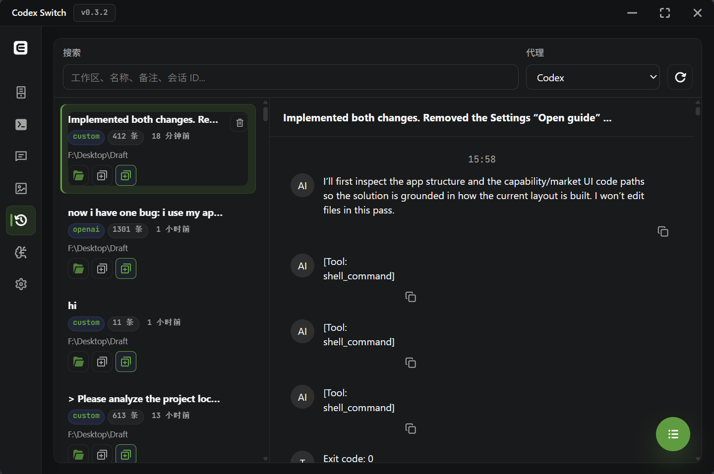</td>
    <td>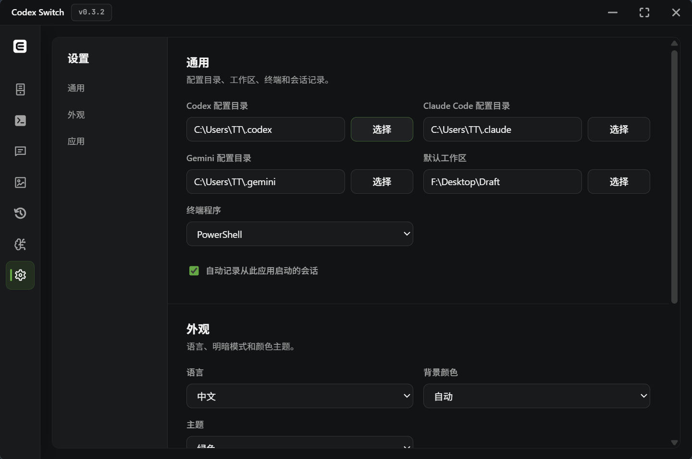</td>
  </tr>
  <tr>
    <td align="center"><sub>浏览本地 transcript、复制 resume 或 handoff 命令，并通过 Repair Visibility 恢复被隐藏的 Codex 会话。</sub></td>
    <td align="center"><sub>配置应用路径、外观、更新、视觉回退和联网搜索。</sub></td>
  </tr>
</table>

<table>
  <tr>
    <th align="center">视觉回退</th>
    <th align="center">联网搜索</th>
  </tr>
  <tr>
    <td>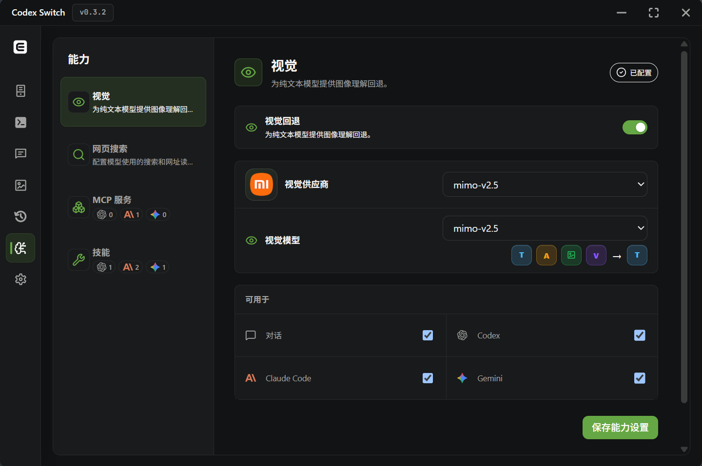</td>
    <td>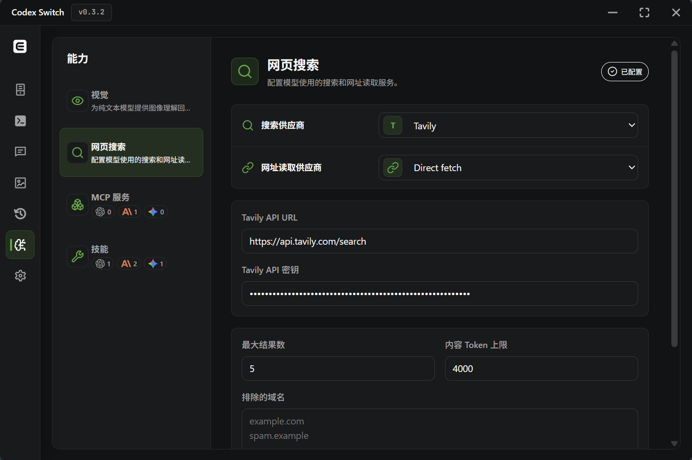</td>
  </tr>
  <tr>
    <td align="center"><sub>为纯文本模型通过配置的视觉 Provider 提供图片理解。</sub></td>
    <td align="center"><sub>配置搜索和网页抓取 Provider，供模型自动调用。</sub></td>
  </tr>
  <tr>
    <th align="center">MCP 服务</th>
    <th align="center">Skills</th>
  </tr>
  <tr>
    <td>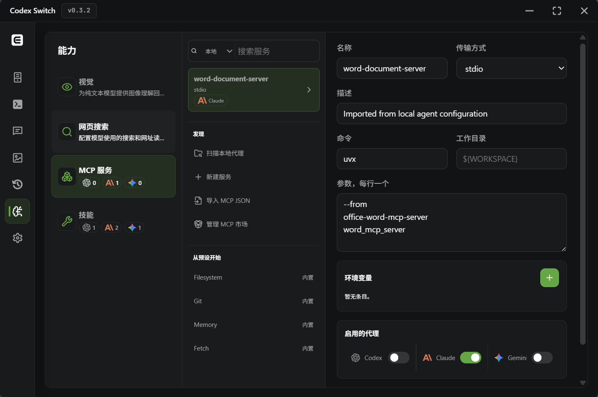</td>
    <td>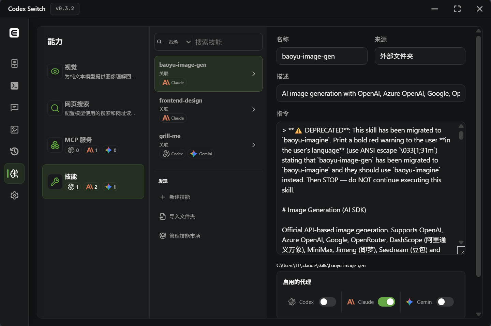</td>
  </tr>
  <tr>
    <td align="center"><sub>跨 Agent 发现、测试、安装和同步 MCP 服务。</sub></td>
    <td align="center"><sub>跨 Agent 发现、查看、安装和同步 Skills。</sub></td>
  </tr>
</table>

<table>
  <tr>
    <th align="center">CLI 视觉输入</th>
    <th align="center">CLI 视觉输出</th>
  </tr>
  <tr>
    <td></td>
    <td></td>
  </tr>
  <tr>
    <td align="center"><sub>CLI 图片上下文会进入本地视觉回退流程。</sub></td>
    <td align="center"><sub>纯文本模型会先收到结构化图片描述，再继续回答。</sub></td>
  </tr>
  <tr>
    <th align="center">CLI 联网搜索请求</th>
    <th align="center">CLI 联网搜索结果</th>
  </tr>
  <tr>
    <td></td>
    <td></td>
  </tr>
  <tr>
    <td align="center"><sub>没有原生联网搜索能力的模型可以调用本地 `web__search` 和 `web__fetch` 工具。</sub></td>
    <td align="center"><sub>兼容代理会把来源上下文返回给模型，用于生成最终回答。</sub></td>
  </tr>
</table>

<table>
  <tr>
    <th align="center">模式</th>
    <th align="center">主题</th>
  </tr>
  <tr>
    <td>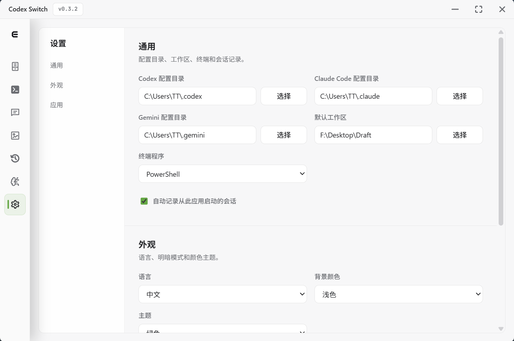</td>
    <td>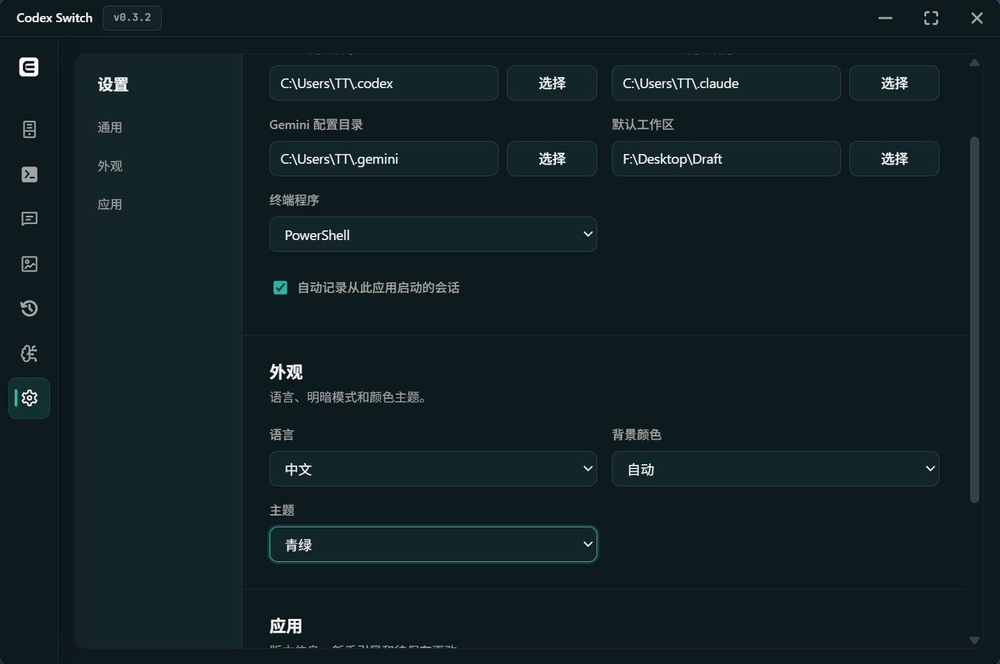</td>
  </tr>
</table>

## 工作原理

### 架构流程

```text
React 功能页面
Providers / Agents / Talking / Drawing / Capabilities / Settings
        │
        ▼
src/api/tauri.ts appApi
        │
        ▼
Tauri invoke(...)
        │
        ▼
src-tauri/src/commands.rs
        │
        ├── database.rs            -> 本地 SQLite 应用状态
        ├── agent_writer.rs        -> Codex / Claude / Gemini 配置文件
        ├── compatibility_proxy.rs -> 127.0.0.1:47632 运行时桥接
        ├── capabilities.rs        -> MCP + Skill 发现、测试、同步
        └── Provider APIs          -> 对话、模型列表、图片生成、OAuth
```

前端用 React 管理页面和表单状态。`src/api/tauri.ts` 是进入 Rust 的唯一桥接层，新开发者可以从功能页面开始，找到对应的 `appApi` 方法，再继续阅读 Tauri command 的实现。

### Provider

```text
ProvidersPage.tsx
        │
        ▼
appApi.saveApiProvider / listProviderModels / startOpenAiOauth
        │
        ▼
commands.rs
        │
        ├── database.save_api_provider  -> 本地可复用记录
        ├── 远程模型列表 / OAuth        -> 可选 Provider 元数据
        └── 已启用 Agent 刷新           -> 认证变化时调用 agent_writer
```

Provider 是可复用的 API 连接配置。前端负责服务商编辑、模型发现、OAuth 入口、官网链接和本地表单状态；后端将 Provider 存入本地 SQLite，并让 API Key 保持在本机。Provider 预设和归一化逻辑把 OpenAI-compatible、Anthropic-compatible、Gemini、Ollama、OpenRouter、Hugging Face 等服务商统一到同一套 UI 模型中。

### Agent

```text
AgentsPage.tsx
        │
        ▼
appApi.saveProvider / activateProvider
        │
        ▼
commands.rs -> database.save_provider / activate_provider
        │
        ▼
agent_writer::write_provider
        │
        ├── Codex  -> ~/.codex/config.toml + ~/.codex/auth.json
        ├── Claude -> ~/.claude/settings.json
        └── Gemini -> ~/.gemini/settings.json + ~/.gemini/.env
        │
        ▼
托盘刷新 + 当前运行配置
```

Agent 配置把保存好的 Provider 绑定到具体运行目标：Codex、Claude Code 或 Gemini。启用某个配置时，Codex Switch 会根据选中的服务商、模型、Base URL、reasoning 选项和额外配置写入目标工具的配置文件。当非原生服务商需要协议转换或回退能力时，生成的配置会指向对应运行时的本地代理路径。

### Chat

```text
TalkingPage.tsx
        │
        ▼
appApi.sendChatMessage
        │
        ▼
commands::send_chat_message
        │
        ├── 可选 vision_fallback::preprocess_chat_messages
        │
        ▼
send_chat_message_blocking
        │
        ├── Anthropic-compatible -> /messages
        ├── Gemini               -> :generateContent
        ├── OpenAI-compatible    -> /chat/completions
        └── OpenAI-compatible + 已配置联网搜索
             -> web__search / web__fetch 循环，最多 8 步工具调用
```

Talking 会通过当前选中的 Provider 和模型发送消息，并在模型支持时保留文件和图片附件。对启用视觉回退的纯文本模型，图片会先由配置的视觉 Provider 转为文字描述。当 OpenAI-compatible 模型或服务商没有原生联网搜索能力时，例如 DeepSeek、MiMo、GLM，Codex Switch 可以先运行本地 `web__search` 和 `web__fetch` 工具，再返回最终回答。

### Drawing

```text
DrawingPage.tsx
        │
        ▼
appApi.generateImage
        │
        ▼
commands::generate_image
        │
        ├── 仅 prompt          -> /images/generations JSON
        └── prompt + 输入图片  -> /images/edits multipart
        │
        ▼
extract_images -> persist_generated_images
        │
        ▼
本地 drawing 图片文件 + Drawing 记录栏
```

Drawing 面向 OpenAI-compatible 图片接口。Anthropic-compatible 和 Gemini Provider 会在这个页面被拒绝，因为这里还没有接入它们的图片生成路由。该功能把 prompt 状态、Provider/模型选择、生成和编辑请求、本地记录、保存后的图片路径、图片缩放交互都限制在 Drawing 功能边界内。

### Sessions 与 Repair Visibility

```text
SessionsPage.tsx
        │
        ▼
appApi.getCachedSessions / refreshSessions / repairCodexSessionVisibility
        │
        ▼
commands.rs -> database.rs -> session_manager.rs
        │
        ├── 缓存会话            -> 首次打开 Sessions 更快
        ├── 手动刷新            -> 重新扫描 Codex / Claude / Gemini 会话文件
        └── Repair Visibility   -> 读取 Codex sessions，修复 Codex state/index 记录，
                                   然后只刷新 Codex Switch 的 Codex 会话缓存
```

Sessions 会在本地建立索引，所以页面打开时不需要每次都重新扫描所有 transcript。用户点击手动刷新时，仍然会重新扫描本地会话文件。Repair Visibility 用于处理 Codex 会话文件仍在本地、但没有出现在 Codex 会话列表里的情况。它会读取配置目录下的 Codex session 文件，修复 Codex 可见性需要的 state/index 记录，然后只更新 Codex Switch 中的 Codex 会话缓存，不会重建所有 Agent 的会话数据。

### 兼容代理

```text
Codex / Claude Code / Gemini CLI
        │
        ▼
需要时由生成配置指向本地网关
        │
        ▼
127.0.0.1:47632
        │
        ▼
compatibility_proxy::handle_connection
        │
        ├── /v1/models        -> 合成当前模型列表
        ├── /v1/responses     -> 原生 Responses API 或 relay_translate 到 Chat
        ├── /anthropic/...    -> Anthropic-compatible 网关
        └── /gemini/...       -> Gemini-compatible 网关
        │
        ▼
启用时在上游调用前应用 vision_fallback 和本地联网工具
```

Codex Switch 会在 `127.0.0.1:47632` 启动一个进程内本地代理。每个请求都会匹配到目标 Agent 当前启用的 Provider。Codex 的 `/v1/responses` 请求会直通支持 Responses 的服务商，或通过 `relay_translate` 调用 `/chat/completions` 后再转换回 Codex 需要的结果。Claude 和 Gemini 网关路径让对应 CLI 也能使用同一套 Provider 与回退逻辑。

### Chat-Completions 中继

```text
Codex CLI /v1/responses 请求
        │
        ▼
compatibility_proxy::handle_chat_completions_provider
        │
        ├── 可选 vision_fallback::preprocess_codex_body
        │
        ▼
relay_translate::translate_request
        │
        ├── 将 Responses input 归一化为 chat messages
        ├── 保留请求元数据：tools、tool_choice、temperature、top_p
        ├── 将 developer messages 转为 system messages
        ├── 将工具转换为 /chat/completions 可理解的 function tools
        │    │
        │    ├── local_shell        -> function shell_command
        │    ├── custom/tool_search -> function tools
        │    ├── namespace          -> 嵌套 function tools
        │    ├── 上游支持时保留 provider web_search
        │    └── 丢弃 proxy-hosted、server-side-only 或未知工具
        ├── 应用 DeepSeek、MiMo、GLM 的服务商兼容逻辑
        │
        ▼
POST provider /chat/completions
        │
        ▼
relay_translate::translate_sync_response 或 handle_chunk
        │
        ├── assistant text      -> Responses message item
        ├── reasoning_content   -> Responses reasoning item
        ├── tool_calls          -> response.function_call events
        └── shell call aliases  -> Codex 的 shell_command schema
        │
        ▼
Codex 收到 Responses 形态的 JSON 或 SSE
```

这个中继层只是协议转换层，不是通用工具执行器。`shell_command`、`apply_patch`、MCP 工具等 Codex 客户端工具，会先被转换成上游模型能看到的 function tool；模型返回 tool call 后，再被转换回 Codex 的 Responses function-call 事件，由 Codex 自己执行。代理只会执行它自己托管的回退工具，例如本地联网搜索。

### 视觉能力

```text
settings + Provider 模型元数据
        │
        ▼
vision_fallback::model_vision_capability
        │
        ├── Vision 或 Unknown -> 保留原始图片请求
        │
        └── TextOnly + 对应开关已启用
             │
             ▼
preprocess_chat_messages / preprocess_codex_body
preprocess_anthropic_body / preprocess_gemini_body
             │
             ▼
使用配置的视觉 Provider describe_image，最多 6 张图片，并缓存描述
             │
             ▼
主模型调用前，把图片 part 替换为 <vision-analysis> 文本
```

视觉回退只在主模型被识别为纯文本模型、且 Talking、Codex、Claude 或 Gemini 的对应开关启用时使用。它可以让 DeepSeek、MiMo、GLM 等纯文本模型通过配置的视觉模型理解图片。图片描述会按图片和提示词缓存，避免重复调用视觉模型。

### 联网搜索能力

```text
没有原生联网搜索能力的模型
        │
        ▼
web__search / web__fetch 工具调用
        │
        ▼
commands.rs 或 compatibility_proxy.rs
        │
        ▼
web_search.rs
        │
        ├── 搜索 Provider：Tavily / 智谱 / Exa / 博查 / SearXNG / Jina
        └── 抓取 Provider：内置直连抓取器 / Jina Reader
        │
        ▼
带编号来源的 JSON 返回给模型生成最终回答
```

自动联网搜索在 Settings 中统一配置，用于需要本地联网能力的模型或服务商，例如 DeepSeek、MiMo、GLM。搜索 Provider 支持 Tavily、智谱、Exa、博查、SearXNG 和 Jina。网页抓取可以使用内置直连抓取器或 Jina Reader。直连抓取会检查重定向、阻止私有和保留网络地址、只接受可读文本格式，并把响应限制为 10 MB。

### 本地联网工具循环

```text
Codex /v1/responses 请求
        │
        ▼
relay_translate::translate_request -> /chat/completions body
        │
        ▼
should_enable_local_web
        │
        ├── Settings 中已启用联网搜索
        └── 已配置搜索 Provider
        │
        ▼
prepare_local_web_agent_body
        │
        ├── 对上游 web loop 强制 stream=false
        ├── 设置 parallel_tool_calls=false
        ├── 移除 provider-native web_search 工具形态
        └── 注入 web__search 和 web__fetch function tools
        │
        ▼
run_local_web_agent，最多 8 步
        │
        ├── POST provider /chat/completions
        ├── 没有 tool_calls
        │       │
        │       ▼
        │   得到最终 assistant answer
        │
        ├── web__search call
        │       │
        │       ▼
        │   web_search::search_keywords -> 带编号来源的 JSON
        │
        ├── web__fetch call
                │
                ▼
            web_search::fetch_urls -> 带编号来源的 JSON
        │
        ▼
追加 assistant tool_call + tool result messages，然后继续循环
        │
        ▼
relay_translate::translate_sync_response
        │
        ▼
Codex 收到最终 Responses JSON 或合成的 Responses SSE
```

这个循环只会在代理内部消费 `web__search` 和 `web__fetch`。如果模型请求的是 `shell_command` 这样的普通 Codex 工具，代理会把 tool call 返回给 Codex，而不是自己执行。这样本地联网搜索和 Codex 原本的工具执行路径保持分离。

### MCP 能力

```text
CapabilitiesPage.tsx
        │
        ▼
appApi.getCapabilitiesState / saveMcpServer / testMcpServer / syncMcpCapabilities
        │
        ▼
commands.rs -> capabilities.rs
        │
        ├── 发现 Codex config.toml、Claude .claude.json、Gemini settings.json
        ├── 保存到 SQLite，UI 隐藏敏感值，并通过 keyring 保存密钥
        ├── 测试 stdio / HTTP / SSE 服务定义
        └── sync_mcp_agent 写回目标 Agent 配置格式
```

Capabilities 页面会从 Codex、Claude Code 和 Gemini 配置文件中发现 MCP 服务。服务可以保存、测试、分配到目标 Agent，并按目标配置格式同步回去。敏感值会在 UI 中隐藏，并在需要时通过操作系统密钥链保存。

### Skill 能力

```text
CapabilitiesPage.tsx
        │
        ▼
appApi.importSkill / saveSkill / searchMarketplace / installMarketplaceSkill
        │
        ▼
commands.rs -> capabilities.rs / marketplace.rs
        │
        ├── 发现 Codex、Claude、Gemini 和 ~/.agents/skills 中的 SKILL.md
        ├── 写入应用管理或外部 Skill 的 SKILL.md
        ├── 从普通管理中隐藏内置系统 Skills
        └── sync_skill_agent 把选中的 Skills 同步到目标 Agent
```

Codex Switch 会从 Codex、Claude Code、Gemini 和共享 Agent skill 目录中发现本地 Skills。内置系统 Skills 会从普通管理中隐藏，外部 Skills 可以被查看并同步到不同目标。通过市场安装的内容会保持固定版本，只有用户明确更新时才变化。

## 安装

下载最新 Windows 版本：

https://github.com/baosen-h/codex-switch/releases/latest

## 构建

```bash
npm install
npm run build
npm run tauri -- build
```

## 开发

- 前端架构和贡献规则：[docs/frontend-architecture.zh-CN.md](docs/frontend-architecture.zh-CN.md)
- 功能边界规则：[src/features/README.zh-CN.md](src/features/README.zh-CN.md)

## 说明

- 主要面向 Windows。
- API Key 保存在本机。
- Drawing 主要面向 OpenAI-compatible 图片接口。
- 视觉回退只会列出已确认支持图片输入和文本输出的模型。

## 反馈与支持

- 遇到问题？请[提交 Issue](https://github.com/baosen-h/codex-switch/issues/new)。
- 欢迎参与改进，可以[提交 Pull Request](https://github.com/baosen-h/codex-switch/pulls)。

## 许可证

MIT。见 [LICENSE](LICENSE)。
